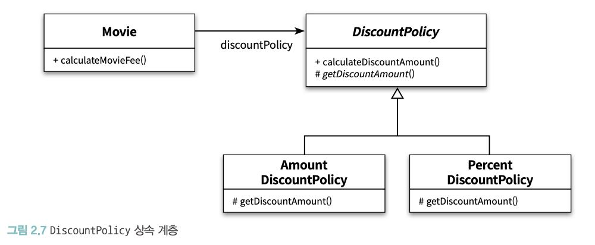

# 리액트에서 객체지향의 상속과 다형성을 어떻게 적용할 수 있을까?
이번 챕터에서는 객체지향 프로그래밍의 핵심 개념인 **상속과 다형성**을 리액트(React) 기반의 프론트엔드 개발에서 어떻게, 언제 풀어낼 수 있을지에 대해 고민해보았습니다.
처음엔 “리액트에서 상속이 가능할까?“라는 질문부터 던지게 되었는데, 리액트는 기본적으로 함수형 컴포넌트를 지향하고, 클래스 기반 상속보다는 조합(Composition) 위주의 설계를 선호합니다. 그렇다면 상속과 다형성이라는 개념을 리액트에서 어떻게 활용할 수 있을까? 이에 대한 저의 해석은 **기능 중심의 공통 컴포넌트를 만들고, 그 위에 스타일이나 역할을 확장하는 구조**였습니다.
---
## 오브젝트 내용
### 상속

- Movie의 인스턴스는 실행 시에 AmountDiscountPolicy나 PercentDiscountPolicy의 인스턴스에 의존해야 한다.
- 하지만 코드 수준에서 Movie 클래스는 이 두 클래스 중 어떤 것에도 의존하지 않는다. 오직 추상 클래스인 DiscountPolicy에만 의존 하고 있다.
- 여기서 이야기하고 싶은 것은 코드의 의존성과 실행 시점의 의존성이 서로 다를 수 있다는 것이다.
- 코드의 의존성과 실행시점의 의존성이 다르면 다를수록 코드를이 해하기 어려워진다는 것이다.
- 반면 코드의 의존성과 실행 시점의 의존성이 다르면 다를수록 코드는 더 유연해지고 확장 가능해진다.
### 다형성
- 코드 상에서 Movie 클래스는 DiscountPolicy 클래스에게 메시지를 전송하지만 실행 시점에 실제로 실행 되는 메서드는 Movie와 협력하는 객체의 실제 클래스가 무엇인지에 따라 달라진다.
- 다시 말해서 Movie 는 동일한 메시지를 전송하지만 실제로 어떤 메서드가 실행될 것인지는 메시지를 수신하는 객체의 클 래스가 무엇이냐에 따라 달라진다.
- 프로그램을 작성할 때 Movie 클래스는 추상 클래스인 DiscountPolicy에 의존한다.
- 따라서 컴 파일 시간 의존성은 Movie에서 DiscountPolicy로 향한다.
- 반면 실행 시점에 Movie의 인스턴스와 실제로 상호작용하는 객체는 AmountDiscountPolicy 또는 PercentDiscountPolicy의 인스턴스다.
- 다형성이란 동일한 메시지를 수신했을 때 객체의 타입에 따라 다르게 응답할 수 있는 능력을 의미한다.
---
## Button 컴포넌트를 중심으로 한 구조 설계
저는 프로젝트에서 공용으로 사용하고 있는 `Button` 컴포넌트를 예로 들어 구조를 살펴봤습니다. 이 컴포넌트는 **디바운스, 중복 클릭 방지, 비동기 처리 시 로딩 상태 표시** 등과 같은 기능 중심의 로직이 담긴 컴포넌트입니다. 다시 말해, 디자인은 최소화하고 기능에 집중된 구조입니다.
그리고 이 기능 중심 `Button` 위에, 다양한 스타일을 적용한 `BorderButton`, `IconButton` 등을 구현하면서 상속과 다형성을 “조합“이라는 방식으로 구현해보았습니다.
결과적으로는 클래스 기반의 `extends`를 사용하는 것이 아니라, 기능을 “물려받은” 컴포넌트를 감싸서 새로운 스타일을 입히는 구조로 설계했습니다. 이 방식은 리액트의 철학에도 잘 맞고, 유지보수도 더 쉬웠습니다.
---
## 코드 예시
### 기능 중심 `Button` 컴포넌트
```tsx
// Button.tsx
export interface ButtonProps {
  onClick?: () => Promise<void> | void;
  disabled?: boolean;
  children: React.ReactNode;
  className?: string;
  type?: ‘button’ | ‘submit’ | ‘reset’;
  debounce?: number; // ms 단위
}
function Button({
  onClick,
  disabled,
  children,
  className = ‘’,
  type = ‘button’,
  debounce = 0,
}: ButtonProps) {
  const [isPending, setIsPending] = useState(false);
  const [lastClick, setLastClick] = useState(0);
  const handleClick = async () => {
    if (disabled || isPending) return;
    const now = Date.now();
    if (now - lastClick < debounce) return;
    setLastClick(now);
    if (onClick) {
      try {
        const result = onClick();
        if (result instanceof Promise) {
          setIsPending(true);
          await result;
        }
      } finally {
        setIsPending(false);
      }
    }
  };
  return (
    <button
      type={type}
      onClick={handleClick}
      disabled={disabled || isPending}
      className={`px-4 py-2 rounded ${
        disabled || isPending ? ‘opacity-50 cursor-not-allowed’ : ‘’
      } ${className}`}
    >
      {isPending ? ‘로딩...’ : children}
    </button>
  );
}
export default Button;
```
### 스타일 확장 `BorderButton`, `IconButton` 컴포넌트
```tsx
// BorderButton.tsx
function BorderButton(props: ButtonProps) {
  return (
    <Button
      {...props}
      className={`border border-blue-500 text-blue-500 hover:bg-blue-50 ${
        props.className ?? ‘’
      }`}
    />
  );
}
export default BorderButton;
```
```tsx
// IconButton.tsx
import Button, { ButtonProps } from ‘./Button’;
function IconButton(props: ButtonProps) {
  return (
    <Button
      {...props}
      className={`flex items-center gap-2 border border-yellow-400 text-yellow-600 hover:bg-yellow-100 ${
        props.className ?? ‘’
      }`}
    >
      
      {props.children}
    </Button>
  );
}
export default IconButton;
```
### 추상 컴포넌트 (Button) 직접 사용 금지하기
1. 직접 사용을 막는 방법
```tsx
// Button.tsx
export const Button: React.FC = () => {
  if (process.env.NODE_ENV !== ‘production’) {
    throw new Error(
      ‘`Button`은 추상 컴포넌트로, 직접 사용하지 말고 BorderButton, IconButton 등을 사용하세요.’
    );
  }
  return ...;
};
```
2. 패키지 수준에서 가려버리기
- `Button.tsx`는 export 하지 않고,
- 외부에는 `BorderButton.tsx`, `IconButton.tsx` 등만 export
### 다형성을 더 살리고 싶다면?
> “다형성이란 동일한 메시지를 수신했을 때 객체의 타입에 따라 다르게 응답할 수 있는 능력을 의미한다.”
- 현재 구조 = 스타일 중심의 “형태 다형성”
  - (어떤 버튼이든 같은 클릭 로직 + 다른 시각적 결과)
- 행동 다형성까지 원한다면
  - *“서브컴포넌트마다 클릭을 다르게 해석한다“*는 비즈니스 요구가 있어야 하고
  - 그때는 onClick을 받아서 가공하거나, 아예 내부 로직 일부를 오버라이드하도록 설계를 확장하면 된다.
- 예시 코드
  ```tsx
  function DangerButton(props: ButtonProps) {
    const handleClick = async () => {
      const ok = window.confirm(‘정말 삭제할까요?’);
      if (!ok) return;
      await props.onClick?.();
    };
    return <ButtonBase {...props} onClick={handleClick} className=“bg-red-500” />;
  }
  ```
## 이 구조의 장점
- 기능 로직은 Button에만 집중되어 있어 유지보수가 쉽고 재사용성이 높음
- 스타일은 외부에서 확장하므로, 디자인 시스템이나 테마 적용도 유연하게 대응 가능
- 다양한 UI 상황에서 Card, Modal, Form 등의 컴포넌트가 Button을 다형적으로 받아서 사용할 수 있음
- 리액트의 조합 철학에 맞게 컴포넌트를 쌓는 방식으로 상속을 자연스럽게 표현
- 이 구조는 단순한 버튼 컴포넌트 외에도, 다른 공통 컴포넌트(예: Input, Card, Modal)에도 충분히 적용 가능한 접근 방식이라고 생각합니다.