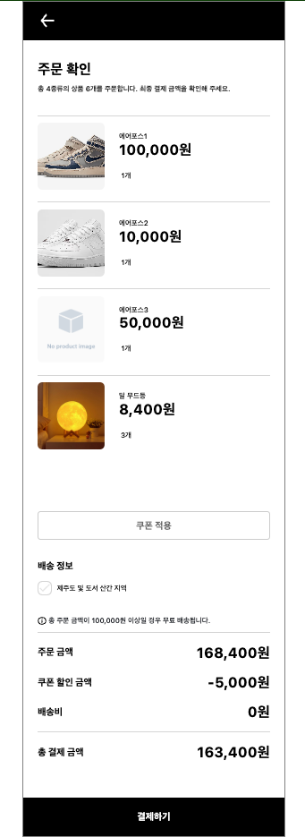

## 데이터 중심의 설계

- 시스템을 설계할 때, 객체의 데이터에 초점을 맞추고 이를 조작하는 정차를 외부에 둔 설계 방식이다.
- 데이터 중심으로 설계하고 접근자와 수정자를 제공하면, 해당 인스턴스 변수가 존재한다는 사실을 퍼블릭 인터페이스에 노골적으로 드러낸다.

## 캡슐화

- 상태와 행동을 하나의 객체 안에 모으는 이유는 객체의 내부 구현을 외부로부터 감추기 위해서이다.
- 캡슐화가 중요한 이유는 변경 가능성이 높은 부분은 내부에 숨기고 외부에는 상대적으로 안정적인 부분만 공개하기 위해서이다.
- 변경 가능성이 높은 부분을 구현, 상대적으로 안정적인 부분을 인터페이스라고 부른다.

## 응집도

- 하나의 목적을 위해 긴밀하게 협력한다면 그 모듈은 높은 응집도를 가진다.


## 결합도

- 의존성의 정도를 나타내며 다른 모듈에 대해 얼마나 많은 지식을 갖소 있는지를 나타내는 척도이다.
- 어떤 모듈이 다른 모듈에 대해 꼭 필요한 지식만 알고 있다면 두 모듈은 낮은 결합도를 가진다.
- 한 모듈이 변경되기 위해서 다른 모듈의 변경을 요구하는 정도로 측정할 수 있다.


## 낮은 응집도

- 하나의 원인에 의해 변경해야 하는 부분이 다수의 모듈에 분산돼 있기 때문에 여러 모듈을 동시에 수정해야 한다.

## 높은 결합도

- 두 객체 사이에 결합도가 높을 경우 한 객체의 구현을 변경할 때 다른 객체에게 변경의 영향이 전파될 확률이 높아진다

### 예시



### [변경 전]

```tsx
function OrderCheckContents({ orderItems }: OrderCheckContentsProps) {
  const navigate = useNavigate();
  const [isRemoteArea, toggleRemoteArea] = useToggle(false);

  // 1) 데이터 패칭 + 데이터 변환
  const { data: coupons, isLoading } = useJaeO<CouponType[], Coupon[]>({
    fetchKey: 'coupons',
    fetchFn: getCoupons,
    // 도메인 객체를 UI가 직접 생성
    convertFn: (data) =>
      data.map((coupon) => new Coupon(coupon, orderItems, false)),
  });

  const { appliedCouponIds, applyCouponIds, isCouponApplied } =
    useAppliedCoupons();

  const { orderPrice, discountAmount, deliveryFee, paymentPrice } =
    useOrderPriceSummary({
      orderItems,
      isRemoteArea,
      coupons,
      isCouponApplied,
    });

  // 2) 배송 옵션 로직 (쿠폰 할인 계산까지 포함)
  const handleShippingOptionChange = () => {
    coupons?.forEach((coupon) =>
      // 배송 옵션 이벤트에서 쿠폰 할인 로직 직접 호출
      coupon.updateDiscountAmount(orderItems, !isRemoteArea)
    );
    toggleRemoteArea();
  };
  const orderItemQuantity = orderItems.length;
  const totalProductQuantity = orderItems.reduce(
    (acc, item) => acc + item.quantity,
    0
  );

  const moveToPaymentCheck = () => {
    // navigate로 직접 결제 이동 처리
    navigate(ROUTE.paymentCheck, {
      state: {
        orderItemQuantity,
        totalProductQuantity,
        paymentPrice,
      },
    });
  };

  // 3) 비즈니스 정책 (자동 쿠폰 적용)
  useEffect(() => {
    if (!coupons || coupons.length === 0) return;

    // 도메인 정책 호출을 UI가 직접 수행
    const topCoupons = selectTopDiscountCoupons(coupons);
    applyCouponIds(new Set(topCoupons.map((coupon) => coupon.data.id)));
  }, [applyCouponIds, coupons, orderItems]);

  return (
    <Modal>
      <S.Container>
        <OrderCheckTitle
          orderItemQuantity={orderItemQuantity}
          totalProductQuantity={totalProductQuantity}
        />
        <S.OrderItemList>
          {orderItems.map((item) => (
            <OrderItem key={item.id} cartItem={item} />
          ))}
        </S.OrderItemList>
        <Modal.OpenTrigger asChild>
          <BorderButton>쿠폰 적용</BorderButton>
        </Modal.OpenTrigger>
        <S.ShippingOptionBox>
          <S.ShippingOptionTitle>배송 정보</S.ShippingOptionTitle>
          <S.ShippingOptionSelectRow>
            <SelectBox
              id="shippingOption"
              selected={isRemoteArea}
              onClick={handleShippingOptionChange}
            />
            <S.ShippingOptionSelectText htmlFor="shippingOption">
              제주도 및 도서 산간 지역
            </S.ShippingOptionSelectText>
          </S.ShippingOptionSelectRow>
        </S.ShippingOptionBox>
        <OrderPriceSummary
          orderPrice={orderPrice}
          discountAmount={discountAmount}
          deliveryFee={deliveryFee}
          paymentPrice={paymentPrice}
        />
        <FooterButton onClick={moveToPaymentCheck}>결제하기</FooterButton>
        <CouponModal
          coupons={coupons}
          couponAppliedIds={appliedCouponIds}
          applyCoupons={applyCouponIds}
        />
      </S.Container>
    </Modal>
  );
}

export default OrderCheckContents;
```

- 응집도 낮은 이유
  - UI 컴포넌트(OrderCheckContents)가 데이터 패칭, 쿠폰 정책, 배송 로직까지 모두 처리
  - 한 컴포넌트가 여러 책임(화면 렌더링 + 비즈니스 로직 + 정책 적용) 수행

- 결합도 높은 이유
  - UI가 쿠폰 도메인 객체와 정책에 직접 접근 (new Coupon, selectTopDiscountCoupons)
  - 배송 옵션이 쿠폰 할인 정책과 직접 연결
  - UI가 라우팅 로직을 직접 처리

### [변경 후]

```ts
export function useCoupons(orderItems) {
  return useJaeO<CouponType[], Coupon[]>({
    fetchKey: 'coupons',
    fetchFn: getCoupons,
    convertFn: (data) =>
      data.map((coupon) => new Coupon(coupon, orderItems, false)),
  });
}
```

```ts
export function useCouponAutoApply(coupons, orderItems) {
  const { applyCouponIds } = useAppliedCoupons();

  useEffect(() => {
    if (!coupons || coupons.length === 0) return;
    const topCoupons = selectTopDiscountCoupons(coupons);
    applyCouponIds(new Set(topCoupons.map((coupon) => coupon.data.id)));
  }, [applyCouponIds, coupons, orderItems]);
}
```

```ts
export function useShippingOption(orderItems, coupons) {
  const [isRemoteArea, toggleRemoteArea] = useToggle(false);

  const handleShippingOptionChange = () => {
    coupons?.forEach((coupon) =>
      coupon.updateDiscountAmount(orderItems, !isRemoteArea)
    );
    toggleRemoteArea();
  };

  return { isRemoteArea, handleShippingOptionChange };
}
```

```tsx
export function CouponSection({ coupons, appliedCouponIds, applyCouponIds }) {
  return (
    <>
      <Modal.OpenTrigger asChild>
        <BorderButton>쿠폰 적용</BorderButton>
      </Modal.OpenTrigger>
      <CouponModal
        coupons={coupons}
        couponAppliedIds={appliedCouponIds}
        applyCoupons={applyCouponIds}
      />
    </>
  );
}
```

```tsx
export function ShippingOptionSelector({ isRemoteArea, onChange }: ShippingOptionSelectorProps) {
  return (
    <S.Container>
      <S.Title>배송 정보</S.Title>
      <S.Row>
        <SelectBox id="shippingOption" selected={isRemoteArea} onClick={onChange} />
        <S.Label htmlFor="shippingOption">제주도 및 도서 산간 지역</S.Label>
      </S.Row>
    </S.Container>
  );
}
```

```tsx
function OrderCheckContents({ orderItems }: OrderCheckContentsProps) {
  const navigate = useNavigate();

  // 1) 쿠폰 데이터 패칭
  const { data: coupons, isLoading } = useJaeO(...);

  // 2) 쿠폰 적용
  const { appliedCouponIds, applyCouponIds, isCouponApplied } = useAppliedCoupons();
  useCouponAutoApply(coupons, orderItems);

  // 3) 가격 요약 계산
  const { orderPrice, discountAmount, deliveryFee, paymentPrice } = useOrderPriceSummary({
    orderItems,
    isRemoteArea: false,
    coupons,
    isCouponApplied,
  });

  // 4) 배송 옵션
  const { isRemoteArea, handleShippingOptionChange } = useShippingOption(orderItems, coupons);

  const orderItemQuantity = orderItems.length;
  const totalProductQuantity = orderItems.reduce((acc, item) => acc + item.quantity, 0);

  const moveToPaymentCheck = () => {
    navigate(ROUTE.paymentCheck, {
      state: {
        orderItemQuantity,
        totalProductQuantity,
        paymentPrice,
      },
    });
  };

  if (isLoading || !coupons) return <Loading />;

  return (
    <Modal>
      <S.Container>
        <OrderCheckTitle
          orderItemQuantity={orderItemQuantity}
          totalProductQuantity={totalProductQuantity}
        />

        <S.OrderItemList>
          {orderItems.map((item) => (
            <OrderItem key={item.id} cartItem={item} />
          ))}
        </S.OrderItemList>

        <CouponSection
          coupons={coupons}
          appliedCouponIds={appliedCouponIds}
          applyCouponIds={applyCouponIds}
        />

        <ShippingOptionSelector
          isRemoteArea={isRemoteArea}
          onChange={handleShippingOptionChange}
        />

        <OrderPriceSummary
          orderPrice={orderPrice}
          discountAmount={discountAmount}
          deliveryFee={deliveryFee}
          paymentPrice={paymentPrice}
        />

        <FooterButton onClick={moveToPaymentCheck}>결제하기</FooterButton>
      </S.Container>
    </Modal>
  );
}

export default OrderCheckContents;
```
